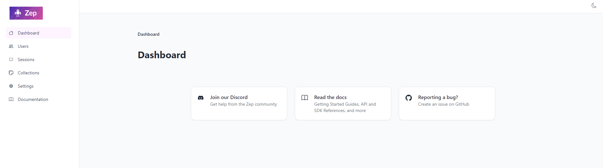

# Zep CI/CD pipeline

Deploy Zep server with CI/CD on Elestio

 
 

# Once deployed ...

You can open Zep UI here:

    URL: https://[CI_CD_DOMAIN]/admin
    email: root
    password: [ADMIN_PASSWORD]

# API Token

To generate a new API token, open a new terminal and do the following:

    ./token.sh
